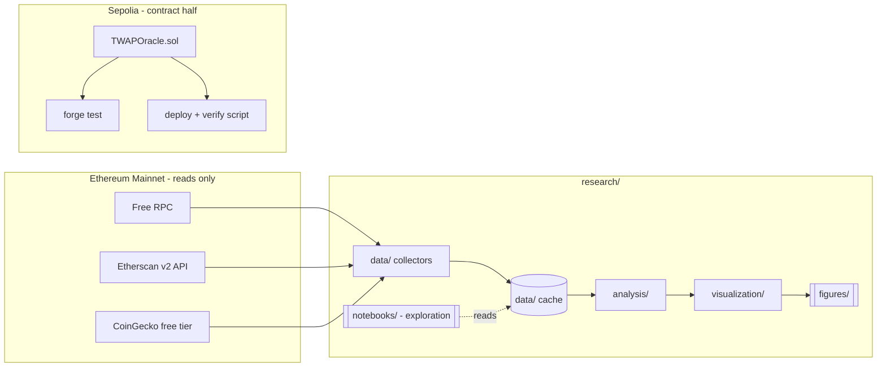

# ChainScope — Architecture (Phase 1)

## What this project is

A two-part portfolio piece for a Wintermute DeFi Algorithmic Trading Internship application:
a Solidity contract on Sepolia, and a Python research toolkit that pulls real Uniswap V3 /
Aave data from mainnet (read-only, free RPC). Both halves are connected by one concept —
**TWAP** — rather than being two unrelated demos glued into one repo.

## Key decisions

### 1. Contract: TWAP Oracle (not a vault/AMM/token)

Chosen over the other options (liquidity vault, simple AMM, vault share token, position
tracker) because it's the one piece of infra a market maker actually touches: manipulation-
resistant pricing via cumulative price accumulation, checkpointed and read back over a
window. It's small enough to reason about fully (a hiring engineer can read the whole
contract in an interview) and it directly motivates the research experiment below — the
contract and the analytics aren't just co-located, they're about the same problem.

Mechanics: a cumulative-price accumulator (`price * timeElapsed`, Uniswap-V2-oracle style)
updated on each observation, with a `consult(window)` view that derives the average price
over an arbitrary look-back from two checkpoints. Custom errors for stale/insufficient
history, an `Observation` event, NatSpec throughout.

**Honest caveat, stated up front so it doesn't read as a gap later:** Sepolia has no real
volume, so this contract will be fed synthetic observations via the deployment/interaction
script, not live-arbitraged prices. It demonstrates the primitive correctly; it is not
"Sepolia's real price." The Python side gets its TWAP data from real mainnet Uniswap V3
pools instead (see below) — the link between the two is conceptual (both compute TWAP,
both care about the same manipulation/staleness tradeoffs), not a live data pipe. This
gets called out explicitly in the README so it reads as a deliberate scope decision, not
an oversight.

### 2. Research experiment: TWAP deviation monitor

Runs against real mainnet Uniswap V3 pools (e.g. USDC/WETH 0.05%) via `slot0` + the
pool's `observe()` oracle. Computes the pool's built-in TWAP over a window, computes an
independent TWAP from raw swap events via pandas, and reports the deviation between them
plus how it moves with pool liquidity/volume. This is the same question a TWAP execution
algo has to answer — "how much does the price I'd get differ from the oracle price, and
why" — which is the connective tissue back to the contract.

### 3. Protocols: Uniswap V3 + Aave v3 (mainnet reads only)

No transactions, no keys needed for this half — `eth_call` against public free-tier RPCs.
Uniswap V3: pool state (`slot0`, `liquidity`, `observe`), swap events for volume/fees.
Aave v3: `PoolDataProvider` reads for reserve data, utilization, rates.

### 4. Package layout (`research/`)

```
research/
  src/
    protocols/     thin typed wrappers over web3.py Contract objects (UniswapV3Pool, AaveV3Reserve)
                   + ABI json. No business logic — just "give me clean data for this address."
    data/          collectors, one per source (uniswap_v3.py, aave.py, coingecko.py, gas.py).
                   Common base class owns retry/backoff/caching ONCE; gotchas from CLAUDE.md
                   (CoinGecko rate limits, Etherscan v2 shape) are handled here, not per-caller.
    analysis/      metrics.py (rolling returns/vol, Sharpe, max drawdown, correlation),
                   twap.py, liquidity.py (utilization, price-impact approximation)
    visualization/ one function per chart type + a shared style module, so every figure
                   looks like it came from the same hand
    utils/         config (dataclass + python-dotenv — no pydantic-settings; nothing here
                   needs schema validation beyond "is this env var set")
  tests/
```

Why collectors own retry/caching centrally: four data sources means four places a network
call can fail. One retry policy in a base class means fixing a bug there fixes it
everywhere, instead of four call sites each getting a slightly different ad-hoc try/except.

### 5. Data flow



The two subgraphs are deliberately not wired together at the data layer — see the caveat
in decision 1.

### 6. Config & secrets

A single `Config` dataclass in `research/src/utils/config.py`, populated from `.env` via
`python-dotenv`. No `pydantic-settings` — nothing here needs schema validation beyond
"is this env var present," so a stdlib-adjacent dataclass is the whole solution.

### 7. Testing / CI (built in Phase 2-3, noted here for the shape)

`forge test` for `contracts/`, `pytest` for `research/`, one GitHub Actions workflow
running both plus ruff + mypy on every push.

## Deliberately deferred to later phases

- Actual directory scaffolding beyond `docs/` (Phase 2)
- ABI files / contract wrapper implementations (Phase 4/7)
- CI workflow file (Phase 2-3 per CLAUDE.md, not bolted on later)
